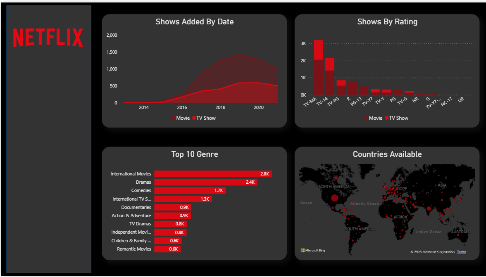
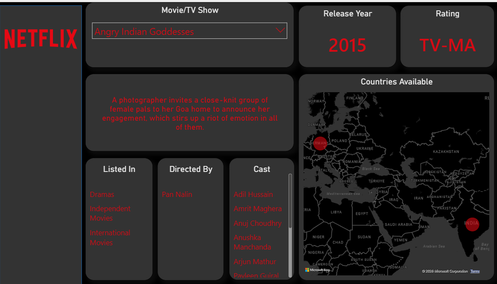

# 📊 Netflix Churn Analysis – End-to-End ETL & Dashboard

## 📌 Project Overview
This project implements a **complete ETL pipeline** for churn analysis:
- Data **extracted from SQL Server** using Python (`SQLAlchemy + pyodbc`).
- Cleaned, transformed, and explored (EDA) in Python.
- Clean data **loaded back into SQL Server** for structured storage.
- Further analysis performed in SQL for KPI generation.
- Data fetched into **Power BI**, where DAX measures and dashboards were created.
- A **custom churn flag** was defined in Power BI to reflect business rules beyond the raw dataset.

## 📸 Dashboard Screenshots

### Overview Dashboard

### Single Title View

---

## ⚙️ Tech Stack
- **SQL Server** → Data storage and KPI queries  
- **Python (ETL + EDA)** → SQLAlchemy, Pandas, Seaborn  
- **Power BI** → DAX measures, interactive dashboards  

---

## 📂 Workflow
1. **Extract**  
   - Connected to SQL Server via Python.  
   - Pulled raw Netflix dataset (login days, watch hours, payments, subscription type).  

2. **Transform & EDA**  
   - Cleaned nulls, duplicates, standardized datatypes.  
   - Engineered features (e.g., churn flag, ARPU, watch-to-fee ratio).  
   - Conducted exploratory analysis with Seaborn visualizations.  

3. **Load Back**  
   - Stored cleaned dataset into SQL Server (`dbo.Netflix_Churn_Clean`).  
   - Ensured consistency for downstream BI tools.  

4. **SQL Analysis**  
   - Wrote queries for churn counts, revenue metrics, subscription breakdowns.  

5. **Power BI Dashboard**  
   - Imported SQL tables.  
   - Created DAX measures for churn rate, revenue lost/retained, % revenue lost.  
   - Built executive-style dashboard with KPIs, bar/pie charts, and text insights.  
   - Added **custom churn flag** in Power BI for refined business-driven analysis.  

---

## 📊 Key Insights
- Churn is **high**, especially in lower-tier plans.  
- **Revenue lost (~8K)** is more than double retained revenue (~3K).  
- **Premium churn** causes disproportionate financial damage.  
- Engagement and payment failures are major churn drivers.  

---

## 💡 Recommended Actions
- Focus retention on **high-value segments** (Premium/Standard).  
- Boost engagement with **personalized recommendations** and gamification.  
- Improve **payment recovery** (retry failed transactions, flexible methods).  
- Deploy **predictive churn modelling** (Python ML: logistic regression, random forest) to flag at-risk customers early.  
- Track churn by **lost revenue**, not just customer count.  

---

## 🚀 How to Run
1. Clone the repo.  
2. Run Python ETL scripts (`etl_pipeline.py`) to extract, clean, and reload data into SQL Server.  
3. Execute SQL queries (`analysis.sql`) for KPIs.  
4. Open Power BI file (`Netflix_Churn.pbix`) to view dashboards.  

